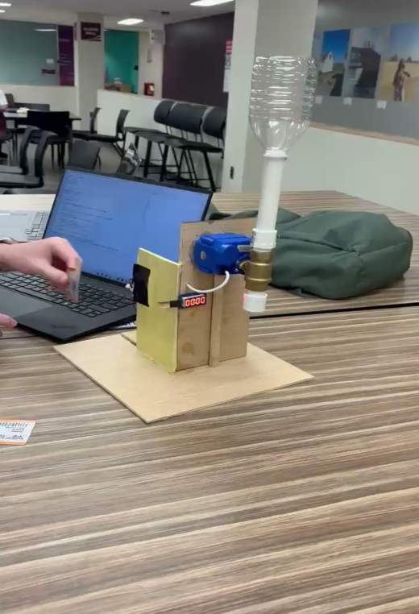

# Smart Shower

An Arduino and Python bench prototype that uses an NFC card to control a motorized ball valve, display shower duration, and award points for shorter sessions.

**Virginia Tech · ENGE 1216 · Spring 2026 · Team F4**



[View wiring and top-down prototype photo](docs/images/prototype-top.png)

## Project status and authorship

This repository reconstructs and extends the team's presentation demo. The original final source files were unavailable; the starting point was the surviving Arduino/Python demo and the team's project brochure. The brochure's code screenshots also show demo scoring. The revised code is not represented as the exact code used during the Spring 2026 presentation.

**Eitan Maman's contributions to the original project:** AI-assisted Arduino and Python development, control logic, all Arduino wiring, substantial hands-on prototyping, NFC and reward-system troubleshooting, and presentation work. Other teammates led CAD work. This repository revision was prepared with AI assistance after the course.

**Team:** Connor Magruder, Eitan Maman, Kaitlin Critides, Payton Shuler, Tripp Davis, and Robert Haufe. Prototype photos are extracted from the team's brochure.

The revised sketch compiles for Arduino UNO; software tests cover scoring, persistence, and firmware state logic. The revised hardware wiring and complete electromechanical system still require bench verification. The project targeted a 10% reduction in water consumption; no measured water savings or campus deployment are claimed.

## How it works

1. Scan a compatible ISO14443A card: the Arduino commands the valve open and starts the timer.
2. Remove the card from the reader for at least 0.75 seconds before scanning again.
3. Scan the same card: the Arduino commands the valve closed and sends the completed session to Python.
4. If another card is scanned after removal, the previous user receives a handover penalty. The valve stays open and a new session begins for the new card.
5. Python records points and session history in a local SQLite database.

Card UIDs identify cards only. This implementation does **not** authenticate Hokie Passports, validate university enrollment, or restrict access to approved students.

## Scoring

The brochure overlaps exact endpoints at 3, 10, and 15 minutes. This revision resolves those boundaries as follows:

| Normal duration | Points | Demo duration |
| --- | ---: | --- |
| Under 3 minutes | 0 | Under 3 seconds |
| 3 minutes to under 10 minutes | 2 | 3 to under 10 seconds |
| 10 minutes to under 15 minutes | 1 | 10 to under 15 seconds |
| 15 minutes or longer | 0 | 15 seconds or longer |
| Handover | 0 | 0 points at any duration |

**Normal mode:** only the first session in each user's rolling 12-hour window can earn points. The window begins at that session's start; a too-short, too-long, or abandoned first session still consumes the window. A new window begins with the first session starting at least 12 hours after the previous anchor. This is a documented implementation choice, rather than fixed noon/midnight windows.

**Demo mode:** uses the scaled timing above and disables the 12-hour restriction. This intentionally differs from the surviving demo's simpler 10–15-second, 2-point-only rule, so a presentation can show all four normal-mode scoring bands. Demo and normal ledgers are separate by default; balances also remain isolated by mode if one database is supplied.

The brochure proposes 10 points for $5 or 20 points for $12 in rewards. These are design concepts only: this repository tracks points, not redemption, dining dollars, gift cards, or payments. It provides a local command-line readout rather than a student-facing app.

## Hardware and wiring

The pin map below assumes a classic Arduino UNO or ATmega328P Nano. Confirm the actual board and module specifications before using it.

| Component signal | Arduino pin |
| --- | --- |
| Relay input | D9 |
| TM1637 CLK | **D5** |
| TM1637 DIO | **D4** |
| PN532 IRQ | D2 |
| PN532 RESET | D3 |
| PN532 SDA | A4 / SDA |
| PN532 SCL | A5 / SCL |

The supplied demo assigned D2 and D3 to both the NFC reader and display. **Move the display connections to D4/D5 to match this code.** Configure the PN532 for I2C using the switches/jumpers appropriate to its exact module; switch positions vary by board.

Supply voltage and level shifting depend on the particular PN532, relay, and display boards. Use each manufacturer's voltage requirements. The valve must have its own suitable power supply and driver; do not power the valve motor directly from an Arduino pin. The code retains the original assumption that one relay state commands open and the other commands closed. A latching or polarity-reversing actuator needs different circuitry and firmware.

In `firmware/SmartShower/SmartShower.ino`, configure:

- `RELAY_ACTIVE_HIGH`: `true` for the original HIGH=open convention; invert only after testing the relay without water connected.
- `DISPLAY_INVERTED`: `true` preserves the prototype's upside-down display mounting.
- `MAX_SESSION_SECONDS`: 5,999 seconds (99:59), an added bench-prototype duration cap. This is not a validated emergency shutoff. Software commands cannot guarantee a physical valve closes on power loss or hardware failure.

This is an exposed bench prototype, not a waterproof or certified shower installation. Verify relay polarity, actuator behavior, isolation, and enclosures before any water test; do not install this reconstruction in an occupied shower.

## Run without hardware

Requires Python 3.10 or newer. From the repository root in PowerShell:

```powershell
'DATA,01020304,300,0' | python backend.py --stdin --mode normal --db data/example.sqlite3
```

On a new database, this synthetic five-minute session earns 2 points. Repeating the command within 12 hours earns 0. The UID is synthetic. For a short demonstration:

```powershell
'DATA,05060708,5,0' | python backend.py --stdin --mode demo
```

No external Python packages are required for stdin mode or the Python tests.

## Run with the prototype

1. Install Arduino IDE and select the actual board and serial port.
2. In Library Manager, install **Adafruit PN532** (including Adafruit BusIO dependencies) and **TM1637 by Avishay Orpaz**.
   Verified build versions: Arduino AVR core 1.8.8, Adafruit PN532 1.3.4, Adafruit BusIO 1.17.4, TM1637 1.2.0.
3. Update physical wiring to the table above and verify the relay configuration.
4. Open `firmware/SmartShower/SmartShower.ino`, compile, and upload.
5. Close Arduino Serial Monitor. From PowerShell at the repository root:

```powershell
python -m venv .venv
.\.venv\Scripts\python.exe -m pip install -r requirements.txt
.\.venv\Scripts\python.exe -m serial.tools.list_ports
.\.venv\Scripts\python.exe backend.py --port COM3 --mode normal
```

Replace `COM3` with your actual port. For presentation timing use `--mode demo`. No Arduino reflash is needed to switch scoring modes. Start Python **before** scanning a card: opening the serial port can reset the Arduino.

## Tests

```powershell
python -m unittest discover -s tests -v
```

Optional C++ logic test (requires a C++ compiler):

```sh
g++ -std=c++11 -Wall -Wextra -pedantic tests/firmware_test.cpp -o firmware_test
./firmware_test
```

See [validation notes](docs/VALIDATION.md) for what has been checked and the remaining hardware acceptance steps.

## Serial protocol and limitations

The original protocol is preserved:

```text
DATA,01020304,300,0
```

Fields are card UID in hexadecimal, duration in whole seconds, and handover flag (`0` normal, `1` handover). `SYS_...` lines are diagnostic messages. The backend validates incoming frames and persists accepted sessions. It reconstructs start time from receive time minus duration, so use a live, single-reader connection with a correctly set computer clock.

There are no message IDs, acknowledgments, retransmission, offline storage on the Arduino, or automatic reconciliation. Completed events can be lost if Python is disconnected. Replayed frames are not deduplicated (normal-mode eligibility limits repeated awards in the same window; demo repeats earn points). An interrupted active session is not recovered after a board reset. Local clock changes and delayed/replayed data can affect eligibility. The finite PN532 read may briefly block the loop; this is not a real-time control system.

Card removal is inferred from unsuccessful reads; an NFC communication fault can look like removal. Validate repeated scans and reader-disconnect behavior on the exact hardware. There is no cryptographic card authentication, flow sensor, leak detection, or valve-position feedback.

## Data and repository hygiene

UIDs and shower timestamps are stored locally in `data/`, which is ignored by Git. Do not commit real card identifiers, database files, serial logs, or credentials. Use synthetic UIDs in screenshots and demos. No software license is assigned to the group work here; agree on licensing with teammates before adding an open-source license.

## References

- [Adafruit PN532 Arduino library and API](https://github.com/adafruit/Adafruit-PN532)
- [Adafruit PN532 guidance on finite activation retries](https://learn.adafruit.com/adafruit-pn532-rfid-nfc/faq)
- [TM1637 display library](https://github.com/avishorp/TM1637)
- Team F4, *Water Waste Solution*, ENGE 1216 Spring 2026 project brochure (design, team attribution, prototype photos).
